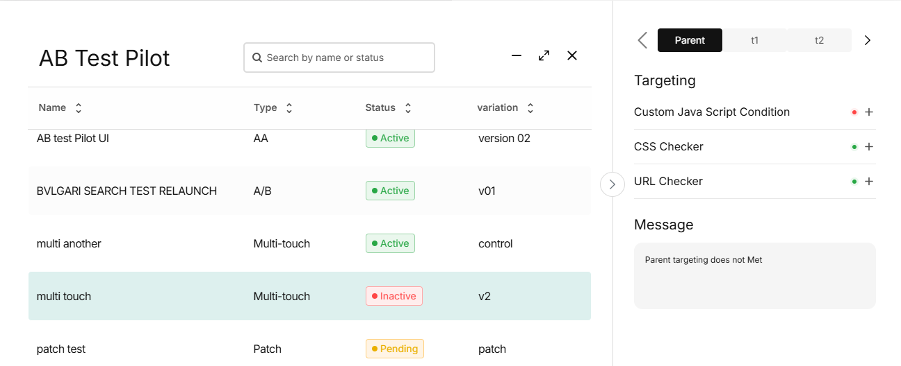
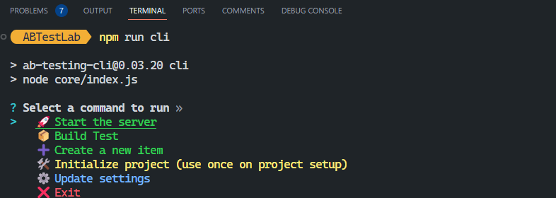

# 🧪 ABTestLab

A powerful CLI-based tool for local development of A/B tests with **live browser previews**. Write test code in your preferred editor, preview changes instantly via a browser extension, and manage tests compatible with platforms like **AB Tasty**, **Dynamic Yield**, **VWO**, **Kameleoon**, **Optimizely**, **Convert**, and more with a beautiful UI which will indicate the test status.


**UI Image**


**Terminal Image**



## 📦 Installation

Make sure you have [Node.js](https://nodejs.org/) installed:

> **Recommended Versions:**
>
> * Node.js: **v18 - v22** (minimum: v14)
> * npm: **v9 - v10** (minimum: v6)

### Install & Initialize:

```bash
# Install dependencies
npm i

# Initialize project (run once after setting up the repo)
npm run cli init

# OR run CLI and select "Initialize project"
npm run cli
```

### Common CLI Commands:

```bash
npm run cli          # Main CLI interface with all features but you can choose shortcut in below:
npm run cli create   # Create website, test, or variation
npm run cli start    # Start a test
npm run cli settings # Configure settings
```

### Browser Integration (For connecting to the browser)

```bash
# Inject the preview snippet into your browser using a browser extension that supports custom java script.
```
> 🔗 **Recommended Chrome Extension**: [User JavaScript and CSS](https://chromewebstore.google.com/detail/user-javascript-and-css/nbhcbdghjpllgmfilhnhkllmkecfmpld?hl=en)


### Extension setup:
```bash
# 1. Open the extension and create a **New Rule**.

# 2. Set a rule name (set any name. e.g., `CLI snippet`).

*://*/*  #3. Use this on the URL pattern

# 4. Paste the following code (iin the bottom) into the `JS section`:
```
```js
(function () {
    'use strict';
    function observeElement(selector, callback, {
        minElements = 1,
        isVariable = false,
        timeout = 10000,
        interval = 5
    } = {}, start = performance.now()) {
        (function check() {
            const elements = isVariable ? window[selector] : document.querySelectorAll(selector);
            if ((isVariable && elements !== undefined) || (!isVariable && elements.length >= minElements))
                return callback(elements);
            if (performance.now() - start < timeout)
                setTimeout(check, interval);
        })();
    }

    const MAIN_URL = 'http://localhost:3000/ab-pilot-script.js';
    const mainScript = document.createElement('script');
    mainScript.setAttribute('src', MAIN_URL);

    observeElement('html', ([html]) => {
        html.appendChild(mainScript);
        const LIVE_UPDATE_URL = 'http://localhost:3000/ab-test-script.js';
        const updateScript = document.createElement('script');
        updateScript.setAttribute('src', LIVE_UPDATE_URL);
        observeElement('html', ([html]) => html.appendChild(updateScript));
    });
})();
```
```bash
# 5. In the bottom right corner of the JS editor section, enable **Run at the start** to inject the code faster. This ensures the script loads immediately before the page finishes loading, similar to how professional tools behave.
```


## 🚀 Features

* ✍️ **Edit & Test Locally** – Write A/B test code and instantly preview results.
* 🧪 **Multiple Test Types** – A/B, AA, Multi-touch, Patch, and more.
* 🧲 **Cross-Platform Compatible** – Works with AB Tasty, VWO, Dynamic Yield, Chameleon, VLo, etc.
* 🌐 **Full Project Management** – Manage websites, tests, and variations from CLI.
* 🧠 **Beautiful Terminal UI** – Interactive and emoji-enhanced.
* 📦 **Build Tests Locally** – Prepare files before uploading to testing tools.
* 🎯 **Flexible Execution** – Run single or multiple tests simultaneously.
* 🔄 **Variation Swapping** – Switch between variations effortlessly.

---

## 🧠 Workflow Overview

1. **Initialize the Project** (One-time).
2. **Create Websites, Tests & Variations** via the CLI.
3. **Write Code** in your code editor (HTML/CSS/JS).
4. **Inject Snippet** in your browser using an extension.
5. **Preview Tests** live with instant updates.
6. **Build Locally** before uploading to a testing platform.


## 🛠️ CLI Commands

Run the CLI:

```bash
npm run cli
```

### Main Menu

```
? Select a command to run
> 🚀 Start the Server
  📦 Build Test
  ➕ Create a New Item
  🛠️ Initialize Project
  ⚙️ Update Settings
  ❌ Exit
```

### 🚀 Start the Server

```
? What would you like to do?
> 🕒 Latest Test
  📚 View Test History
  🎯 Run a Single Test
  🚀 Run Group Tests
  🔙 Back
  ❌ Exit
```

#### 🕒 Latest Test Options

- 🚀 Run Latest Test
- 🔄 Change Variation
- 🔄 Change Test

---

### ➕ Create a New Item

```
? Select an option:
> 🆕 Create New Website
  🌐 ---- website 1 ---
  🌐 ---- website 2 ---
  ...
```

#### 🌐 Website Options

- 🆕 Create New Test
- 🆎 Test 1 – A/B Test
- 📊 Test 2 – AA Test
- 🎯 Test 3 – Multi-touch Test
- 🩹 Test 4 – Patch Test

---

#### 🆎 Test Options

```
? Select an option:
> 🆕 Create New Variation
  🎭 ---- variation 1 ---
  🎭 ---- variation 2 ---
  ...
```

#### 🎭 Variation Options

- 🚀 Start Variation
- 📜 See Test Details
- 📦 Build Variation
- 📤 Copy Variation to Another Test
- ✏️ Rename Variation
- 🗑️ Remove Variation

---

## 📚 History and Settings

```
📚 History Records Count: 10
🎨 CSS Reload: No
🖼️ Display UI: Yes
📜 JS Reload: No
📦 Bundler Settings
💾 Save and Exit
❌ Exit
```

---

## 🧪 Test Types

| Type              | Description                        | Icon |
|-------------------|------------------------------------|------|
| A/B Test          | Compare two or more variants       | 🆎   |
| AA Test           | Identical variant comparisons      | 📊   |
| Multi-touch Test  | Compare multiple changes at once   | 🎯   |
| Patch Test        | Small change deployment            | 🩹   |

---

## 📂 Full Project folder and file Structure

```
project structure : 
ABTestLab
├── .vscode/                         # VS Code configuration files
├── core/                            # Core functionalities
│   ├── client/                      # Client-side scripts
│   │   ├── browser-Runner.js
│   │   └── browser-script.js
│   ├── commands/                    # CLI commands
│   │   ├── create.js
│   │   ├── init.js
│   │   ├── settings.js
│   │   └── start.js
│   ├── global/                       # Global configurations
│   │   └── config.js
│   ├── public/                       # Static assets for frontend
│   │   ├── css/
│   │   │   └── index.css
│   │   ├── documents/                # documentation
│   │   │   ├── complete_todo.md
│   │   │   └── todo.md
│   │   ├── html/
│   │   │   └── index.html
│   │   ├── icons/
│   │   │   └── close.svg
│   │   ├── js/                        # JavaScript assets
│   │   │   ├── main/
│   │   │   │   └── index.js
│   │   │   ├── vendor/                 # Third-party scripts
│   │   │   └── socket-io-client.js
│   ├── scripts/                        # Utility scripts
│   │   ├── createSettingFile.js
│   │   ├── createSkeleton.js
│   │   └── downloadSocketIo.js
│   ├── server/                         # Server-side scripts
│   │   ├── browserScriptCreator.js
│   │   └── testServer.js
├── templates/                         # Initial Templates for A/B tests
│   ├── targeting/                     # Targeting rules
│   │   ├── customJS.js
│   │   ├── elementChecker.json
│   │   └── urlChecker.json
│   ├── targetMet/                     # When and how target conditions are met
│   │   ├── customJS.js
│   │   ├── elementChecker.js
│   │   └── urlChecker.js
│   ├── variation/                      # Variation-related files
│   │   ├── index.js
│   │   ├── info.json
│   │   └── style.scss
│   ├── utils/                          # Utility functions
│   │   ├── bundler.js
│   │   ├── creatorPrompts.js
│   │   ├── creators.js
│   │   ├── cssUtils.js
│   │   ├── fileUtils.js
│   │   ├── historyUtils.js
│   │   ├── selectors.js
│   │   └── startUtils.js
│   └── index.js
├── skeleton/                          # Skeleton structures
├── websites/                          # Websites-related configurations
├── package.json
├── node_modules/                      # Dependencies
├── settings.json
├── history.json                        # Execution history
├── .gitignore                          # Git ignored files
└── README.md                           # Project documentation
```

---

## 💡 Example Use Cases

- Create local tests before uploading to AB testing platforms.
- Perform rapid QA with live browser previews.
- Manage large sets of websites and tests from one place.
- Simplify teamwork with reusable variation templates.

---

## 🛠️ One-Time Setup

Initialize your project (only once or after `npm install`):

```bash
🛠️ npm run cli init
```

---

## 📤 Build for tool (if needed)

Build your test locally:

```bash
📦 npm run cli build #build a test
```

You can then upload your built files to your desired A/B testing platform.

---

## 🔒 Requirements

- Node.js v14+
- Browser extension installed for snippet injection

---

## 🙌 Contributing

**marufbillah03033@gmail.com**

---

## 📄 License

### **MIT-Restricted License**  

**Copyright (c) 2025 maruf1020**  

Permission is hereby granted, free of charge, to any person obtaining a copy  
of this software and associated documentation files (the "Software"), to deal  
in the Software without restriction, including without limitation the rights  
to use, copy, modify, merge, publish, distribute, and sublicense the Software,  
subject to the following conditions:  

1. **Commercial Use Restriction**  
   - Any person, company, or organization intending to use this software for **commercial purposes, profit, or financial gain** must obtain prior **written permission** from the copyright holder (**maruf1020**).  
   - Commercial use means using the software to make money. This includes things like selling it, renting it out, offering it as a paid service, or using it in any product or service that makes money.

2. **Grant of Use to Echologyx Ltd**  
   - As the copyright holder is an employee of **Echologyx Ltd**, the company **Echologyx Ltd** is **granted a non-exclusive, royalty-free license** to use, modify, and distribute this software 

3. **Inclusion of Copyright Notice**  
   - The above copyright notice and this permission notice shall be included in all copies or substantial portions of the Software.  

4. **Warranty Disclaimer**  
   - THE SOFTWARE IS PROVIDED "AS IS", WITHOUT WARRANTY OF ANY KIND, EXPRESS OR IMPLIED, INCLUDING BUT NOT LIMITED TO THE WARRANTIES OF MERCHANTABILITY, FITNESS FOR A PARTICULAR PURPOSE, AND NONINFRINGEMENT. IN NO EVENT SHALL THE AUTHORS OR COPYRIGHT HOLDERS BE LIABLE FOR ANY CLAIM, DAMAGES, OR OTHER LIABILITY, ARISING FROM, OUT OF, OR IN CONNECTION WITH THE SOFTWARE OR THE USE OR OTHER DEALINGS IN THE SOFTWARE.  

For commercial licensing inquiries, please contact: **marufbillah03033@gmail.com**.  

---

## 📞 Support

For help, bugs, or feature requests, reach out via [GitHub Issues](https://github.com/maruf1020/ABTestLab/issues) or email: `marufbillah03033@gmail.com`
